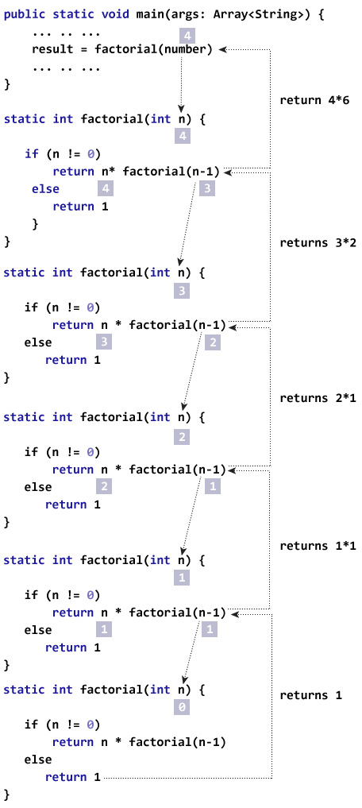

# Lab Assignment 15

In this lab you will practice working with recursion.

Unlike previous labs, your class has already been created for you. 

## Let's get started!

For this lab your **main() method** is in the Main class. For this lab you can create new classes inside the Main.java file or create a new file in the **src/** directory.

Now let's begin!

## Recursion

In past labs we have called methods from other methods, however when a method calls itself it's know as a **recursive method**.

For example, look at the `recursion()` method below and see how it call itself.

**Warning:** Do not run this method on your computer, it will run infinitely until the program is terminated.

```java
public static void main(String[] args) {
	// First Call
	recursion();
}

public static void recursion() {
	System.out.println("Hello");
	// Recursive Call
	recursion();
}
```

Recursion can be used to solve complex problems, however it's not the only way to solve problems. Anything recursion can do, a loop can do as well. Recursive methods are simpler to write.

It's important to always include a **Base Case** in your recursive methods. Base cases prevent your recrusive method from calling itself infinitely.

The objective of your recursive method should be to break down a complex problem into a simpler one. For example, let's find the factorial(!) of a number *n*.

**Factorial of *n*!:**

* If *n* = 1, then *n*! = 1
* If *n* > 1, then *n*! = 1 x 2 x 3 x ... x *n*

Let's write a recursive method to sovle the factorial for *n* (*n*!).

First let's write our **Base Case**, if *n* = 1, then *n*! = 1.

```java
void static int factorial(int n) {
	// Base Case
	if (n == 1)
		return 1;
}
```

Now, let's break down the rest of the problem. We need to multiply `n` by `n-1` by `n-2` by `n-3` and so on until we reach `1`. So let's write a solution where we recursively multiply and decrement `n` until we reach `1`.

```java
void static int factorial(int n) {
	// Base Case
	if (n == 1)
		return 1;
	// Solution for Factonial n!
	return n * factorial(n - 1);
}
```

Let's test our solution with 4! = 4 x 3 x 2 x 1 = 24.

If our first method call is `factorial( 4 )` our output will be 24, success!

Look at the image below to see the recursive method `factorial( 4 )` broken down.



For more examples and practice problems visit: https://www.w3schools.com/java/java_recursion.asp and https://www.programiz.com/java-programming/recursion

## Your Program

### Exponents (Power of) using Recursion

For your assignment, create your own `pow(x, y)` method that return the solution to $x^y$, however <ins>your solution must use **recursion**</ins>.

**Exponents $x^y$:**
* if y = 0, then $x^y$ = 1
* if y = 1, then $x^y$ = *x*
* if y > 1, then $x^y$ = x1 * x2 * x3 * ... * xy. Ex: $2^3$ = 2 * 2 * 2 = 8.

Your `pow(x, y)` method must be declared inside of `Main` and must be **static**.

You can test your solution by running the command below in your terminal.

```
./test.sh
```

## Submit your assignment

[Grading Criteria](https://joselitoguardado.dev/3326/labs/Lab_15.pdf)

[How to Submit Assignments to GitHub](https://joselitoguardado.dev/3326/How_to_Submit_Assignments_to_GitHub.pdf)